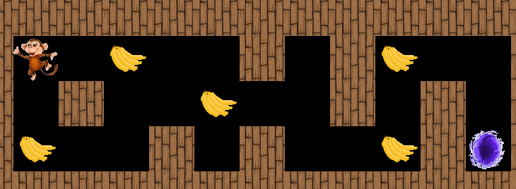
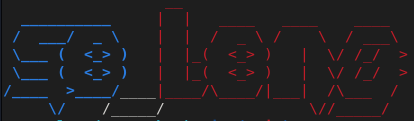

# 🐒 SO_LONG - (monkey edition)

*This project is a small 2D game. Its purpose is to have you work with textures, sprites, and other basic gameplay elements.*


## ⭐ Visualisation



## 🔥 Usage

#### Clone my repo :
```bash
git clone https://github.com/cfioux/so_long.git
```
#### Clone the MiniLibx in my repo:
```bash
git clone https://github.com/42Paris/minilibx-linux minilibx-linux
```

> Now, you can `make` or `make bonus`



## 🤸🏽 Movement

| Deplacement | Direction |
|:-------- |:--------:|
| A / ←     | Left   |
| D / →     | Right   |
| W / ↑     | Top   |
| S / ↓     | Bottom   |
