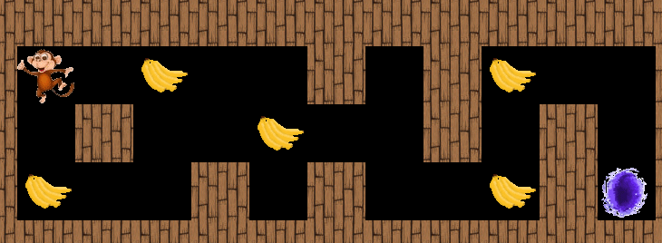

# SO_LONG 🐒

*This project has been created as part of the 42 curriculum by cfioux--.*


## 🔥​ Descriptions



---

### 👣 ​Moovements

| Touch | Movements |
| ------ | ------ |
| **a / ⬅️**​ | *Left* |
| **w / ⬆️​** | *Top* |
| **d / ➡️​** | *Right* |
| **s / ​⬇️​** | *Bot* |
|||

## 📍​ Instructions

**clone my repo** :
```
git clone git@github.com:cfioux/so_long.git
```

**USAGE :**

```
make
```
```
./so_long maps/<map_name>.ber
```
**or** (for animations)
```
make bonus
```

```
./so_long_bonus maps/<map_name>.ber
```
---

## Resources

* **Man minilibx**: `https://github.com/42paris/minilibx-linux/tree/master/man/man1`

* **Minilibx guid**: `https://harm-smits.github.io/42docs/libs/minilibx/getting_started.html`

---
